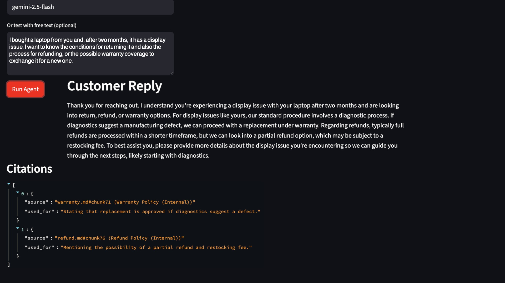

# Agentic_SupportSystem-rag-sql

## Abstract

Agentic Support System RAG SQL is an end-to-end AI platform that connects structured, SQL-based operational data with retrieval-augmented generation and large language model reasoning to automate and review support decision workflows.
The system pulls real-time ticket, customer, and order information from a relational database, grounds its responses in internal policy documents through semantic search, and generates structured, machine-readable actions along with clear, customer-facing replies.
A full-stack web interface built with FastAPI and Streamlit allows users to run workflows interactively, visualize reasoning traces, and monitor overall system performance.

---

## What this repo demonstrates

* **SQL + Database**: SQLite schema, seeded customers/orders/tickets, and safe read-only SQL tools.
* **Agentic workflow (explicit tools)**: The agent orchestrates **tool calls** (SQL context, RAG search, ticket events) and logs every step.
* **LLM layer (Gemini)**: Gemini generates **structured JSON** responses grounded in retrieved policy text.
* **RAG**: Semantic search over internal documents (e.g., refund and warranty policies) to produce citations.
* **Web app**: Streamlit UI and FastAPI backend with full trace and audit visibility.

---

## Project architecture

```
ui/                 Streamlit frontend
app/                FastAPI backend
agt/                Agent + tools orchestration
db/                 SQLite schema + logging + SQL utilities
rag/                RAG system (vector ingestion + FAISS and embeddings)
scr/                Scripts (seed DB, tests)
dat/raw/            Input ticket dataset (CSV)
docs/               Internal policy markdowns used for RAG
```


---

## Setup (step-by-step)

### 1) Clone and enter the project

```bash
git clone https://github.com/abbaszal/Agentic_SupportOps.git
cd Agentic_SupportOps
```

### 2) Create and activate a virtual environment

```bash
python -m venv .venv
source .venv/bin/activate
```

### 3) Install dependencies

```bash
pip install -r requirements.txt
```

---

## Data and Database (Seed)

### 4) Download/Place dataset

The dataset is already included in this repository under:

```
dat/raw/tickets_clean.csv
```

This file contains a **pre-cleaned collection of historical customer support tickets** (subjects, message bodies, customer emails, priority, status, and categories).

It is used to **seed the SQL database** so the agent can:

* Retrieve real ticket context
* Link tickets to customers and orders
* Find similar past issues during reasoning

No manual download is required — the dataset is ready to use.
When you run `python -m scr.seed`, this file is automatically parsed and inserted into the database.

### 5) Create and seed the database

```bash
rm -f db/app.db
python -m scr.seed
```

**What happens:**

* Creates a fresh SQLite database from `db/schema.sql`
* Inserts:

  * ~400 customers
  * 6 products
  * ~800 orders
  * ~800 tickets

You should see output similar to:

```
customers: 400
products: 6
orders: 800
tickets: 800
```

---

## Quick sanity check (SQL tools)

### 6) Test SQL context retrieval

```bash
python -m scr.test_sql_tool
```

---

## RAG System — Vector Ingestion, Storage, and Semantic Search

This project implements a **local, fully transparent Retrieval-Augmented Generation (RAG) pipeline** using FAISS and Sentence Transformers. The system converts internal policy documents into searchable vectors and retrieves the most relevant policy chunks.

---

## RAG File Structure

```
docs/        ← Input policy documents
out/         ← Generated vector index and metadata
rag/
ingest.py   ← Builds vector database
search.py   ← Queries vector database at runtime
```

---

## Step 1 — Policy Documents (`dat/docs`)

All internal knowledge is stored as **Markdown files**:

```
dat/docs/
refund.md
warranty.md
shipping.md
sla.md
```

These documents define:

* Refund rules
* Warranty conditions
* Shipping policies
* Service-level agreements

---

## Step 2 — Vector Ingestion (`rag/ingest.py`)

This script **builds the semantic search engine**.

Run it once after adding or editing policy files:

```bash
python -m rag.ingest
```

### What this script does

Reads all Markdown files from:

```
dat/docs/
```

Each document is split into overlapping chunks:

```python
chunk_text(text, chunk_size=650, overlap=120)
```

Converts text into vectors using a transformer embedding model:

```python
MODEL_NAME = "sentence-transformers/all-MiniLM-L6-v2"
```

The vectors are stored in a FAISS similarity index:

```python
index = faiss.IndexFlatIP(dim)
index.add(emb)
```

### Output files

The script writes two files:

#### Vector index

```
dat/out/rag.faiss
```

Contains:

* All policy vectors
* Optimized for fast similarity search

#### Metadata store

```
dat/out/rag_meta.jsonl
```

Contains:

```json
{
  "doc_id": "refund.md",
  "doc_title": "Refund Policy",
  "chunk_id": 71,
  "text": "Standard tier customers may request a refund within 14 days..."
}
```

This allows the system to:

* Recover original text
* Generate citations
* Display policy sources in the UI

---

## Semantic Search (`rag/search.py`)

This file is used **at runtime by the agent** to retrieve policy context.

---

## Run the full web app (FastAPI and Streamlit)

### 7) Set your Gemini API key (Terminal 1)

```bash
export GEMINI_API_KEY="YOUR_API_KEY"
```

### 8) Start the backend API (Terminal 1)

```bash
uvicorn app.api:app --reload --port 8000
```

### 9) Start the Streamlit UI (Terminal 2)

```bash
streamlit run ui/app.py
```

Open:

* [http://localhost:8501](http://localhost:8501)

---

## Examples


### Ticket example

> I've encountered a data loss issue with my Earbuds Air. All the files and documents seem to have disappeared. Can you guide me on how to retrieve them? Please take time to ask if there is something else I can do. I've checked for software updates, and my Earbuds Air is already running the latest version.

```md

```
---


### Free text example

> I bought a laptop from you and, after two months, it has a display issue. I want to know the conditions for returning it and also the process for refunding, or the possible warranty coverage to exchange it for a new one.

```md

```


